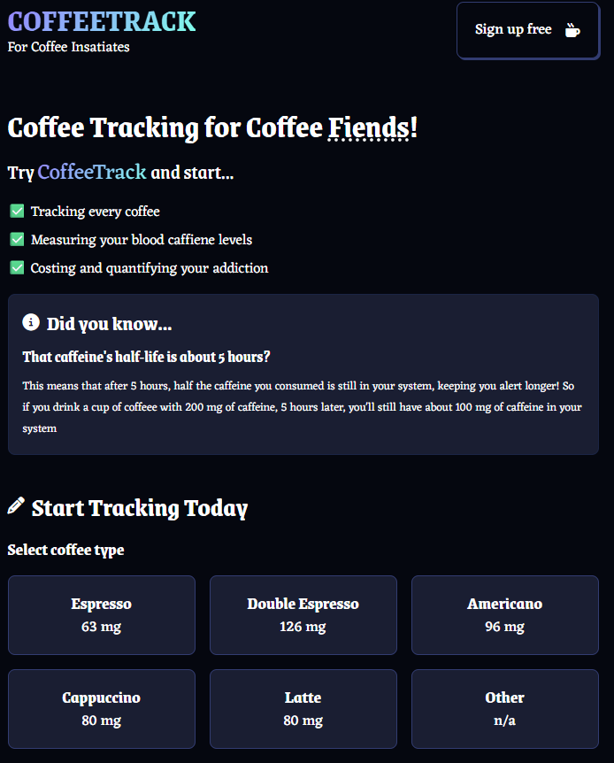
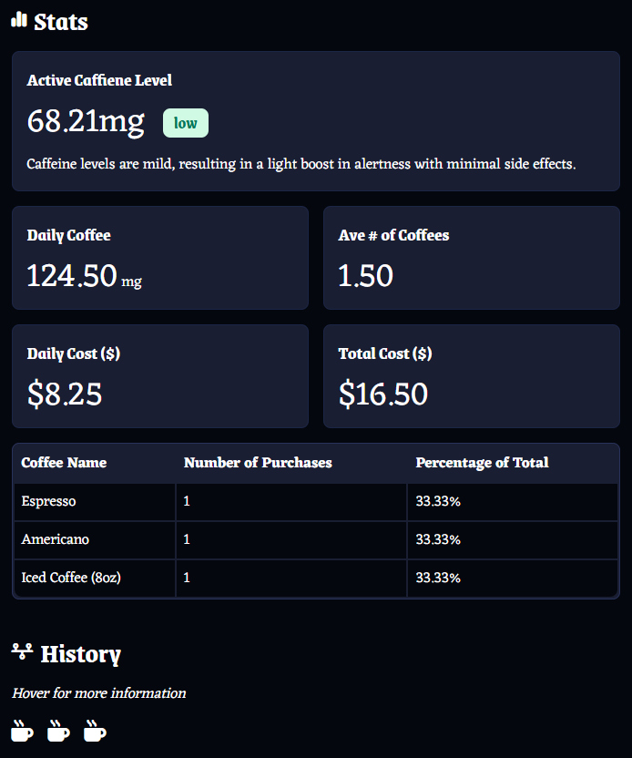

# CoffeeTracked Web App ☕️

### A web application that helps coffee enthusiasts track their coffee consumption, monitor their caffeine levels, and view detailed coffee statistics over time.  


## Features

- **Coffee Expenditure Tracking:** Log each cup and see your spending habits.
- **Caffeine Level Monitoring:** Keep track of your daily caffeine intake.
- **Coffee History:** View all your logged coffee entries.
- **Stats Dashboard:** Analyze your coffee habits over time.
- **Authentication:** Secure login and registration for personal data tracking.
- **Responsive Design:** Works on desktop and mobile devices.

---

## Demo
🔗 [CoffeeTracked](https://coffeetracked.netlify.app/)

<p float="left">
  
  
</p>

---

## Project Structure
```
src/
├── components/
│ ├── Authentication.jsx # Login and registration components
│ ├── CoffeeForm.jsx # Form for logging coffee intake
│ ├── Hero.jsx # Landing page hero section
│ ├── History.jsx # Displays user's coffee history
│ ├── Layout.jsx # Main layout wrapper
│ ├── Modal.jsx # Modal component for alerts/confirmations
│ └── Stats.jsx # Coffee statistics dashboard
├── context/
│ └── AuthContext.jsx # React context for authentication state
├── utils/
│ └── index.js # Utility functions
├── App.jsx 
├── fanta.css # Custom styles  
├── index.css # Global styles
├── main.jsx # Entry point for React
├── .gitignore 
├── eslint.config.js # ESLint configuration
├── firebase.js # Firebase configuration
└── index.html 
```
---

## Installation & Usage

```bash
git clone https://github.com/rakeebh7233/coffee-track.git
cd coffee-tracker
npm install
```
Set up Firebase:
Replace the configuration in firebase.js with your Firebase project credentials.

Starting the project:
```bash
npm run dev
```
Go to http://localhost:5173

---

## Technologies Used
* React.js
* Firebase Authentication & Firestore
* JavaScript (ES6+)
* CSS (Custom & Global styles)
* Vite 

---
## Credits
* CSS styling inspired by Fantacss by jamezmca — MIT License
